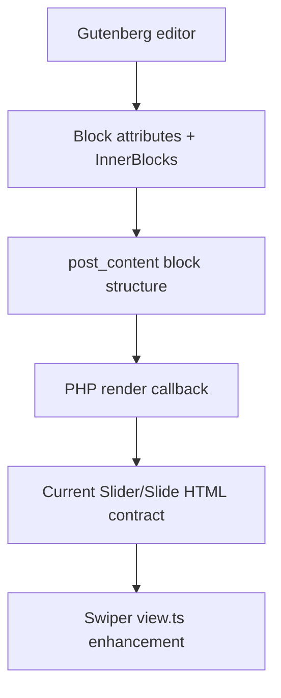

# V1 / 1.3.0 — Slider Dynamic Rendering Architecture Planning

Status: PENDING
Created: 2026-06-08
Current milestone remains: V1 / 1.2.1

## 1. Decision

Move `skvn-marine/slider` and `skvn-marine/slide` from static Gutenberg saved
frontend markup to server-rendered PHP blocks in a dedicated milestone.

This is an architectural milestone, not an incidental bug patch. The migration
must preserve the current editor model, InnerBlocks, attributes, presets, block
names, and Swiper behavior.

## 2. Why Dynamic Rendering

The Slider family is still early, but its frontend markup is already changing.
Keeping static saved markup would require Gutenberg deprecations for every
meaningful frontend structure revision. As Hero, Product Showcase, Card
Carousel, and future presets evolve, those historical save functions compound.

Dynamic rendering moves the frontend HTML contract to one maintained PHP render
path:



Frontend markup changes then apply consistently to existing pages without
adding another saved HTML generation for each preset iteration.

## 3. Static Versus Dynamic Boundary

Keep static/editor-owned:

- Block attributes.
- InnerBlocks structure and editable content.
- Slider variations/templates.
- Editor stacked preview.
- Gutenberg List View and native block actions.

Move to dynamic/server-owned:

- Slider frontend shell.
- Slide media, overlay, and content wrappers.
- Attribute-to-class and attribute-to-data serialization.
- Server-side escaping of image URL, alt text, classes, and JSON/data output.

Keep JavaScript-owned:

- Swiper initialization.
- Touch, keyboard, loop, fade, autoplay, arrows, dots, and breakpoints.
- Reduced-motion runtime behavior.

## 4. Target Render Contract

Slider shell:

```html
<div class="wp-block-skvn-marine-slider skvn-slider swiper ..."
     data-skvn-slider="...">
  <div class="skvn-slider__wrapper swiper-wrapper">
    <!-- rendered skvn-marine/slide blocks -->
  </div>
  <!-- optional arrows -->
  <!-- optional pagination -->
</div>
```

Slide shell:

```html
<div class="wp-block-skvn-marine-slide skvn-slide swiper-slide ...">
  <div class="skvn-slide__media">
    
    <span class="skvn-slide__overlay" aria-hidden="true"></span>
  </div>
  <div class="skvn-slide__content">
    <!-- rendered InnerBlocks -->
  </div>
</div>
```

The media wrapper is structural. Image intrinsic dimensions must not decide the
visual height of Hero slides.

## 5. Migration Questions To Resolve Before Code

- Whether Slider and Slide both receive PHP render callbacks, or Slider owns
  final composition while Slide supplies a renderable child contract.
- The exact WordPress block registration path for plugin PHP modules.
- How legacy static block content is parsed and passed through the first dynamic
  render without invalid-block recovery.
- Whether current `save.tsx` functions become `null`, preserve InnerBlocks
  serialization, or require a transitional deprecated definition.
- How Product Showcase and Card Carousel opt out of Hero background layering
  without duplicating render engines.
- How frontend render output is tested independently from editor preview.

## 6. Expected Source Impact

Likely existing files:

```text
wp-content/plugins/skvn-marine-blocks/src/index.ts
wp-content/plugins/skvn-marine-blocks/src/slider/block.json
wp-content/plugins/skvn-marine-blocks/src/slider/save.tsx
wp-content/plugins/skvn-marine-blocks/src/slider/style.css
wp-content/plugins/skvn-marine-blocks/src/slide/block.json
wp-content/plugins/skvn-marine-blocks/src/slide/save.tsx
wp-content/plugins/skvn-marine-blocks/skvn-marine-blocks.php
```

Likely new plugin-owned PHP module:

```text
wp-content/plugins/skvn-marine-blocks/modules/slider-render/
```

The final path must follow the plugin's established module/bootstrap convention
after that convention is inspected during the milestone.

Because this milestone will add PHP runtime `require`/`include` paths, deploy
artifact and plugin zip audits are mandatory.

## 7. Compatibility Strategy

Compatibility is a release requirement, not a cleanup task:

- Inventory every currently saved Slider/Slide markup shape.
- Keep block namespace and attributes stable.
- Prove existing pages open without invalid-block recovery.
- Prove existing pages render through the new PHP contract before resaving.
- Retain only the minimum deprecated/static compatibility code WordPress
  requires for editor parsing; do not keep multiple active frontend engines.
- Document removal criteria for transitional compatibility code.

## 8. Testing Strategy

Editor:

- Open existing Slider pages.
- Confirm no invalid/recovery warning.
- Edit, reorder, duplicate, and remove slides.
- Insert all three presets.

Frontend:

- Verify existing and newly inserted Slider blocks.
- Use images with different dimensions and aspect ratios.
- Verify Hero media/content layering.
- Verify Product Showcase and Card Carousel flow layouts.
- Verify arrows, dots, fade, autoplay, loop, keyboard, breakpoints, and reduced
  motion.

Deployment:

- Run plugin build.
- Run PHP syntax checks for every new runtime PHP file.
- Build deploy artifact.
- Package plugin zip.
- Confirm the slider render module exists in the zip.

## 9. Non-Goals

- No custom slide manager.
- No `slides` array replacing InnerBlocks.
- No second Slider runtime.
- No Fullscreen Step Slider wipe/video/tab feature expansion.
- No namespace, slug, text-domain, or option-key rename.
- No GeneratePress parent-theme changes.

## 10. Relationship To Current Bug

The frontend media/content layer bug exposed the architectural weakness but does
not justify silently changing render models inside milestone 1.2.1.

Until 1.3.0 starts:

- Keep the bug documented.
- Do not implement the superseded static markup migration.
- Do not mark frontend Slider QA as passed.
- Reconcile the execution order of 1.2.9 onsite QA and 1.3.0 migration before
  either milestone is started, so QA tests the intended render architecture.
