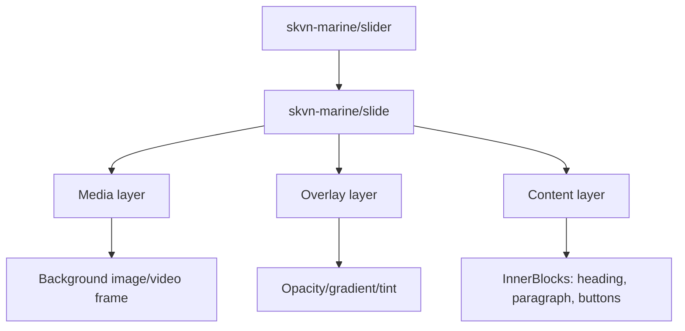

# Slider Block — Decision Log

Status: active decision — editor implementation completed in 1.2.0
Milestone: V1 / 0.3.0; editor completion: V1 / 1.2.0
Layer: Plugin `skvn-marine-blocks` (logic/portable structure) + Theme `skvn-marine` (tokens/visual overrides)
Last updated: 2026-06-08

---

## 1. Scope

Build `skvn-marine/slider` và `skvn-marine/slide` trong plugin `skvn-marine-blocks`.

Slider là plugin-owned vì nếu thay theme thì interactive behavior không được mất — đúng với boundary rule trong `AGENTS.md`.

---

## 2. Dependency — Swiper

Giữ Swiper. Rationale từ V1 decision vẫn còn nguyên giá trị.

Swiper được dùng vì:
- Touch, keyboard, loop, autoplay, pagination — không tự handle trong V1.
- Modular import: chỉ load `Autoplay`, `EffectFade`, `EffectZoom`, `Keyboard`, `Navigation`, `Pagination`.
- Scoped hoàn toàn vào slider frontend view script — không load global.
- Production-safe nhanh hơn custom implementation cho V1.

Alternatives rejected:
- Custom slider runtime: rủi ro accessibility và browser support cao cho V1.
- CSS-only carousel: không đủ cho keyboard, loop, autoplay.
- Builder/plugin slider: vi phạm source-control và block ownership.

Load rule:
- Swiper chỉ load qua `slider/view.ts` frontend script.
- Editor dùng stacked preview, không run Swiper autoplay.

Removal plan:
- V2 có thể thay bằng custom runtime nếu cần. Khi đó: xóa `swiper` khỏi `package.json`, xóa Swiper imports khỏi `src/slider/view.ts`, rebuild.

---

## 3. Swiper vs tự viết — phân công rõ ràng

| Behavior | Swiper | Tự viết | Ghi chú |
|---|---|---|---|
| Touch / swipe | ✅ | — | Built-in, mature |
| Keyboard navigation | ✅ | — | Module `Keyboard` |
| Loop logic | ✅ | — | Complex edge cases, để Swiper xử lý |
| Autoplay + pause on hover | ✅ | — | Module `Autoplay`, `pauseOnMouseEnter: true` |
| Fade transition | ✅ | — | Module `EffectFade` |
| Zoom transition | ✅ | — | Module `EffectZoom` |
| Dots / progress bar / numbers sync | ✅ | — | Module `Pagination` custom render |
| Arrow navigation | ✅ | — | Module `Navigation`, icon swap qua attribute |
| Mouse parallax `--mx` / `--my` | — | ✅ | Swiper không có, tự viết trong `view.ts` |
| Blob decorative toggle + reflow | — | ✅ | CSS + attribute, không liên quan Swiper |
| Animate-in stagger per slide | — | ✅ | Hook vào Swiper `slideChangeTransitionStart` |
| Speed feel presets (cubic-bezier) | — | ✅ | Override CSS transition trên `.swiper-slide` |
| `prefers-reduced-motion` guard | — | ✅ | Disable autoplay + parallax khi reduce |
| Editor stacked preview | — | ✅ | Swiper không chạy trong editor |

---

## 4. Kiến trúc — lộ trình A → C

### Phase A — Style variants (V0.3.0, hiện tại)

Một block duy nhất. Logic trong `slider/view.ts`. CSS variants qua `is-style-skvn-*`.

```
src/slider/
  block.json
  edit.tsx
  save.tsx
  view.ts      ← Swiper init + parallax handler + stagger hooks
  types.ts
src/slide/
  block.json
  edit.tsx
  save.tsx
  types.ts
```

### Phase B — Extract shared (trigger: variant 2 confirmed)

Không rewrite. Move logic ra `shared/slider.ts`, thêm import. Block interface, CSS, `block.json` không đổi. Zero breaking change.

```
src/shared/
  slider.ts    ← initParallax(), initStagger(), speedPresets{}
  motion.ts    ← prefersReducedMotion() (đã có)
src/slider/
  view.ts      ← Swiper init + import shared/slider.ts
```

Trigger thực tế, không phải calendar: không refactor khi variant 2 chưa xuất hiện.

### Phase C — Base module (V2 scope)

Separate block registrations. Block cũ `skvn-marine/slider` giữ nguyên hoặc làm deprecated wrapper — không rename để tránh vỡ pages đã publish.

```
src/slider-base/
  view.ts      ← Swiper init + shared runtime
  types.ts
  block.json   ← base attribute schema
src/slider/          ← hero variant
  view.ts      ← extends base, thêm parallax + blob
src/slider-minimal/  ← variant N
  view.ts      ← extends base, CSS riêng
```

### Bất biến xuyên suốt 3 phase

- `block.json` attribute schema không đổi interface
- `is-style-skvn-*` CSS class naming
- Namespace `skvn-marine/slider`
- `prefers-reduced-motion` guard bắt buộc

---

## 5. CSS pattern — Hero slider

### Mouse parallax

Dùng CSS custom properties `--mx`, `--my` set bởi JS. CSS lo transform.

```css
.skvn-slider__blob--1 { transform: translate3d(calc(var(--mx) * -80px), calc(var(--my) * -60px), 0); }
.skvn-slider__blob--2 { transform: translate3d(calc(var(--mx) * 70px),  calc(var(--my) * -50px), 0); }
.skvn-slider__blob--3 { transform: translate3d(calc(var(--mx) * -50px), calc(var(--my) * 70px),  0); }

@media (max-width: 768px), (pointer: coarse) {
  .skvn-slider__blob--1,
  .skvn-slider__blob--2,
  .skvn-slider__blob--3 { transform: none !important; }
}
@media (prefers-reduced-motion: reduce) {
  .skvn-slider__blob--1,
  .skvn-slider__blob--2,
  .skvn-slider__blob--3,
  .skvn-slider__parallax-bg,
  .skvn-slider__content-parallax { transform: none !important; }
}
```

### Animate-in stagger (hook vào Swiper event)

```css
.skvn-slide .skvn-slide__animate-in > * {
  opacity: 0;
  transform: translateY(24px);
  transition: all 0.8s cubic-bezier(0.2,0.8,0.2,1);
}
.skvn-slide.is-active .skvn-slide__animate-in > * { opacity: 1; transform: translateY(0); }
.skvn-slide.is-active .skvn-slide__animate-in > *:nth-child(1) { transition-delay: 0.05s; }
.skvn-slide.is-active .skvn-slide__animate-in > *:nth-child(2) { transition-delay: 0.15s; }
.skvn-slide.is-active .skvn-slide__animate-in > *:nth-child(3) { transition-delay: 0.25s; }
.skvn-slide.is-active .skvn-slide__animate-in > *:nth-child(4) { transition-delay: 0.35s; }
```

Class `is-active` được add/remove qua Swiper `slideChangeTransitionStart` event.

---

## 6. Required behavior (giữ từ decision cũ, bổ sung)

- Slider config từ block attributes.
- `skvn-marine/slide` chỉ được dùng inside `skvn-marine/slider`.
- Frontend slide output must keep media, overlay, and content in separate
  layers. Do not render a slide background `` as an unwrapped normal-flow
  sibling of headings, paragraphs, or buttons.
- Keyboard navigation bắt buộc (Swiper `Keyboard` module).
- Autoplay pause on hover (`pauseOnMouseEnter: true`).
- `prefers-reduced-motion`: disable autoplay, disable parallax.
- Frontend JSON config parsing phải được guard.
- Editor preview: stacked, không run Swiper, không run autoplay.
- Each stacked Slide previews and edits its selected background image directly.
- Không set `opacity: 0` trong editor nếu không có safe fallback.

---

## 7. Controls — marketing editor

### Per-slide (edit trực tiếp trong canvas)

| Control | Type |
|---|---|
| Heading | rich text |
| Lead text | rich text |
| CTA label + URL | button block |
| Background image | media upload |
| Overlay opacity | 0–80% |

### Inspector sidebar — Playback

| Control | Default | Range/Options |
|---|---|---|
| Autoplay | on | toggle |
| Delay | 5s | 3–10s |
| Loop | on | toggle |
| Max slides | — | ≤ 5 |

### Inspector sidebar — Transition

| Control | Options |
|---|---|
| Effect | Fade, Zoom |
| Speed feel | Smooth, Snappy, Gentle, Dramatic |

Speed feel presets (hardcoded):

| Label | cubic-bezier |
|---|---|
| Smooth | `(0.4, 0, 0.2, 1)` |
| Snappy | `(0.2, 0, 0, 1)` |
| Gentle | `(0.4, 0, 0.6, 1)` |
| Dramatic | `(0.7, 0, 0.3, 1)` |

Duration và raw curve values không expose.

### Inspector sidebar — Navigation

**Arrows:**

| Control | Options |
|---|---|
| Show | toggle |
| Icon | 4 presets: chevron, arrow, arrow-narrow, caret |
| Position | Inside / Outside |

**Progress indicator:**

| Control | Options |
|---|---|
| Show | toggle |
| Style | Progress bar / Dots / Numbers |

Progress bar duration tự tính từ autoplay delay.

### Inspector sidebar — Decorative layer

| Control | Default |
|---|---|
| Blob 1 | on |
| Blob 2 | on |
| Blob 3 | off |

Khi tắt blob, CSS reflow tự xử lý — không để khoảng trống.

### Inspector sidebar — Motion

| Control | Default | Ghi chú |
|---|---|---|
| Parallax on hover | on | Auto-off: touch + reduced-motion |

Intensity hardcoded.

---

## 8. Hardcode — không expose

- Parallax intensity values
- Transition duration
- Cubic-bezier raw values
- Animate-in stagger delays
- `will-change`, `z-index` logic
- Blob positions và shapes
- Progress bar animation duration

---

## 9. Variant roadmap

**Variant 1 — Hero slider** (V0.3.0): parallax blob, dramatic, full viewport.

**Variant 2 — chưa define.** Xác định trước khi trigger Phase B. Candidates chưa confirmed:
- Testimonial / partner logo slider
- Product highlight
- Banner / promotional

Quyết định: không tạo variant 2 cho đến khi có use case thật sự trên site.

---

## 10. Open questions

- [ ] Numbers style cho progress indicator (`2 / 5`) — giữ hay bỏ?
- [ ] Variant 2 là gì? Xác định trước khi trigger Phase B.
- [ ] Slide order — drag-and-drop reorder trong editor hay chỉ add/delete?

## 11. V1 / 1.2.1 MVP Preset Decision

The active follow-up decision is:

- `docs/decisions/slider-presets-and-inserter-1.2.1.md`

Summary:

- Keep stacked direct editing.
- Do not build a custom slide manager for MVP.
- Use native Gutenberg List View/actions for slide structure operations.
- Add one `SKVN Marine` Block Inserter category.
- Add Hero Slider, Product Showcase, and Card Carousel as variations/templates
  over the existing Slider/Slide runtime.

### 10.1. Question for Dev to trigger Variant 2

Bạn cần ngồi lại và trả lời: trên toàn bộ site SKVN Marine hiện tại và roadmap V1, có những chỗ nào cần slider không phải hero style? Liệt kê ra thì mới biết variant 2 là gì và trigger của Phase B có thật không hay chỉ là 1 variant duy nhất đến V2:

- **Slider hero** — cái đang thiết kế, full viewport, parallax blob, dramatic transition. Dùng ở homepage top section.
- **Slider testimonial / partner logos** — nhẹ hơn nhiều, không cần parallax, thường là horizontal scroll với dots, dùng ở trust section hoặc about page.
- **Slider product highlight** — có thể là một product feature showcase, ảnh lớn + specs bên cạnh, transition khác hẳn.
- **Slider banner** — promotional, đơn giản, progress bar, không blob.

## 12. Frontend Layer Contract — Media, Overlay, Content

This contract was added after the V1 / 1.2.1 frontend render bug documented in
`docs/testing/slider-frontend-media-content-layer-bug-1.2.1.md`.

Slider/Slide currently uses static Gutenberg `save()` output; it does not use a
PHP `render_callback`. The proposed static markup migration was superseded
before implementation. The approved target is V1 / 1.3.0 dynamic rendering,
documented in
`.context/planning/017_VERSION_1_3_0_SLIDER_DYNAMIC_RENDERING_ARCHITECTURE_PLANNING.md`.
Compatibility with existing static content remains a release requirement.

The editor stacked preview and frontend render may use different implementation
paths, but they must represent the same visual layers:



Required frontend slide shape:

```html
<div class="wp-block-skvn-marine-slide skvn-slide swiper-slide skvn-slide--has-background">
  <div class="skvn-slide__media">
    
    <span class="skvn-slide__overlay" aria-hidden="true"></span>
  </div>

  <div class="skvn-slide__content">
    <!-- InnerBlocks content -->
  </div>
</div>
```

Required ownership:

| Layer | Owns | Must not own |
|---|---|---|
| `.skvn-slide` | stable slide frame, positioning context, Swiper slide class | raw image sizing logic |
| `.skvn-slide__media` | image/video frame and clipping | text/buttons |
| `.skvn-slide__background-image` | `object-fit: cover` media fill | slide height decisions |
| `.skvn-slide__overlay` | tint/gradient over media | layout spacing |
| `.skvn-slide__content` | heading, paragraph, buttons, InnerBlocks content | background media |

Forbidden pattern:

```html
<div class="skvn-slide swiper-slide">
  
  <span class="skvn-slide__overlay"></span>
  <h2>...</h2>
  <p>...</p>
</div>
```

The forbidden pattern makes image and text normal-flow siblings. It causes
content to fall below the image, slide heights to depend on image dimensions, and
pagination/footer position to become unstable.

Swiper owns movement, loop, fade, keyboard, autoplay, arrows, and dots. It must
not be used as a substitute for the slide visual frame. CSS and render markup
must define the frame before Swiper initializes.

Fullscreen Step Slider references may be used only for this layer separation
idea during V1. Do not adopt its `slides` array attribute model, custom slide
manager, custom autoplay controller, static `save()` output, wipe/video/tab
feature set, or theme-template override hooks unless a later milestone approves
that architecture explicitly.
