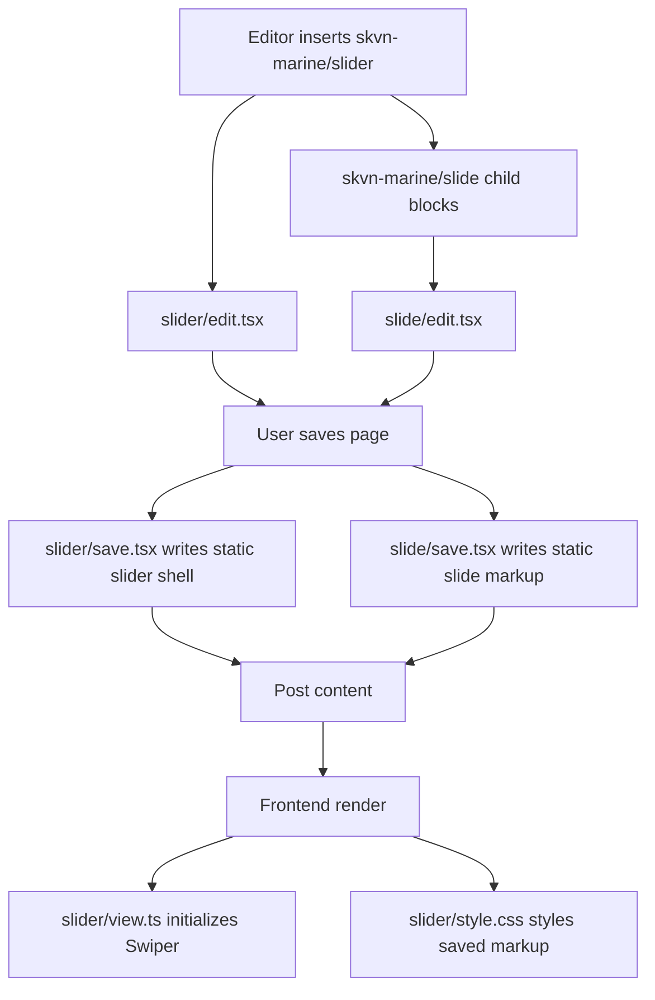
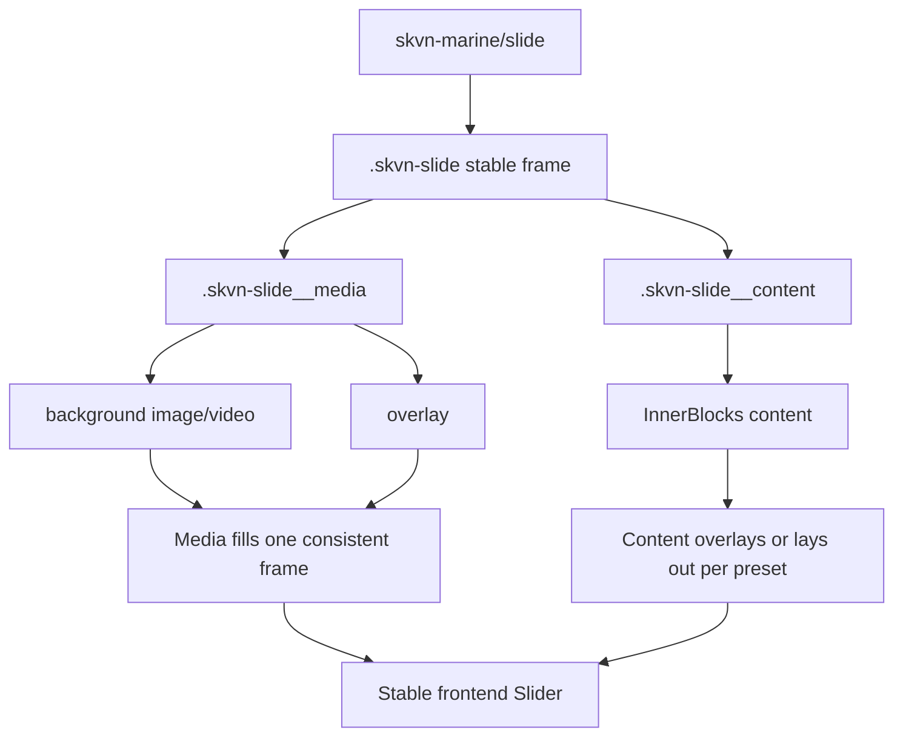
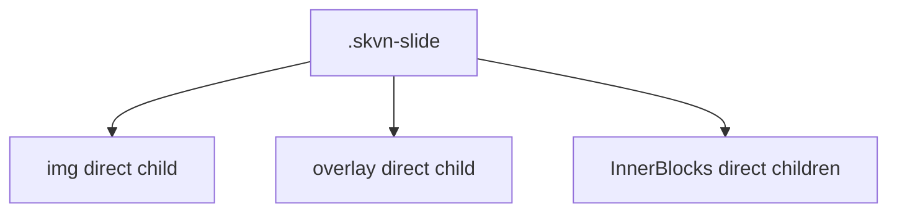
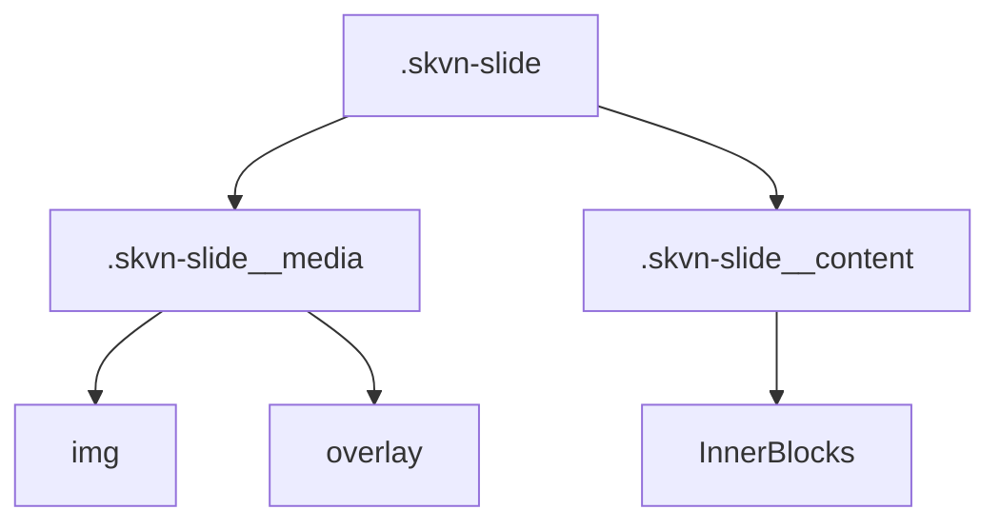

# Slider Static Markup Migration — 1.2.1 Decision

Date: 2026-06-08
Status: superseded before implementation by V1 / 1.3.0 dynamic rendering planning
Milestone: V1 / 1.2.1 — SKVN Slider Presets & Inserter

## Superseding Decision

Human review on 2026-06-08 rejected implementing another static saved-markup
generation as the long-term Slider fix. Because the Slider block family is
still early and is expected to gain more presets, static markup deprecations
would create compound migration debt.

The approved architectural direction is now:

```text
V1 / 1.3.0 — Slider Dynamic Rendering Architecture
.context/planning/017_VERSION_1_3_0_SLIDER_DYNAMIC_RENDERING_ARCHITECTURE_PLANNING.md
```

No source implementation from the static migration plan below was performed.
The analysis is retained as an audit record of the rejected approach and the
legacy markup shape that the dynamic migration must support.

## Previous Decision

Fix the Slider frontend media/content bug with a full static-block-safe
migration, not with a manual resave-only workaround.

This decision treats the bug as compound technical debt because Slider/Slide is
a reusable block contract. If the saved markup remains loose, every future
Slider preset or variant can inherit the same media sizing and content layering
failure.

## Architecture Finding

The active Slider implementation is static Gutenberg saved markup:



There is no PHP `render_callback` in the current Slider/Slide path. Therefore,
fixing only runtime PHP is not available, and fixing only `save.tsx` can leave
already-saved pages on old markup until they are migrated or resaved.

## Current Failure

Current saved `skvn-marine/slide` markup puts media, overlay, and InnerBlocks
content as siblings:

```html
<div class="skvn-slide swiper-slide skvn-slide--has-background">
  
  <span class="skvn-slide__overlay"></span>
  <h2>...</h2>
  <p>...</p>
</div>
```

This makes the image and content normal-flow siblings. CSS can raise the content
with `z-index`, but it cannot turn this into a durable layer contract for
multiple Slider presets.

## Target Architecture

The saved frontend markup must match the documented layer contract:

```html
<div class="skvn-slide swiper-slide skvn-slide--has-background">
  <div class="skvn-slide__media">
    
    <span class="skvn-slide__overlay" aria-hidden="true"></span>
  </div>

  <div class="skvn-slide__content">
    <!-- InnerBlocks content -->
  </div>
</div>
```



## Implementation Direction

Use Gutenberg deprecations/migration for `skvn-marine/slide`.

The new block version will:

- Save `.skvn-slide__media` around background image and overlay.
- Save `.skvn-slide__content` around `InnerBlocks.Content`.
- Keep the same attributes and block namespace.
- Keep Swiper as the only Slider movement/runtime dependency.
- Keep Slider presets as variations over the same `skvn-marine/slider` and
  `skvn-marine/slide` blocks.

The legacy block version will:

- Preserve the old `save()` shape in a `deprecated` entry so Gutenberg can
  recognize existing saved content.
- Migrate existing attributes and inner blocks to the current save shape without
  renaming the block.
- Avoid requiring manual HTML cleanup as the primary fix path.

## Files Affected

Expected source files:

```text
wp-content/plugins/skvn-marine-blocks/src/slide/save.tsx
wp-content/plugins/skvn-marine-blocks/src/slide/edit.tsx
wp-content/plugins/skvn-marine-blocks/src/slide/deprecated.tsx
wp-content/plugins/skvn-marine-blocks/src/index.ts
wp-content/plugins/skvn-marine-blocks/src/slider/style.css
```

Expected generated files after build:

```text
wp-content/plugins/skvn-marine-blocks/build/index.ts.js
wp-content/plugins/skvn-marine-blocks/build/index.ts.asset.php
wp-content/plugins/skvn-marine-blocks/build/style-index.ts.css
wp-content/plugins/skvn-marine-blocks/build/style-index.ts-rtl.css
```

Documentation already updated:

```text
docs/decisions/slider-block.md
docs/testing/slider-frontend-media-content-layer-bug-1.2.1.md
```

## Architecture Change

Before:



After:



The architectural change is not a new Slider engine. It is a stricter saved
markup contract for the existing static block.

## Non-Goals

- Do not add a PHP `render_callback` as part of this fix.
- Do not rename `skvn-marine/slider` or `skvn-marine/slide`.
- Do not convert slides to an array attribute or custom slide manager.
- Do not add a custom autoplay controller.
- Do not add Fullscreen Step Slider features such as wipe transitions, tab
  navigation, video background, or theme template hooks in 1.2.1.

## Acceptance Checklist

- [ ] Existing saved Slider content is recognized by Gutenberg via deprecation.
- [ ] Current save output contains `.skvn-slide__media`.
- [ ] Current save output contains `.skvn-slide__content`.
- [ ] Frontend Hero Slider content overlays the media frame.
- [ ] Different image dimensions keep the same slide frame.
- [ ] Product Showcase and Card Carousel remain flow-based and readable.
- [ ] Swiper fade/autoplay/arrows/dots/keyboard remain functional.
- [ ] `npm run build` passes.
