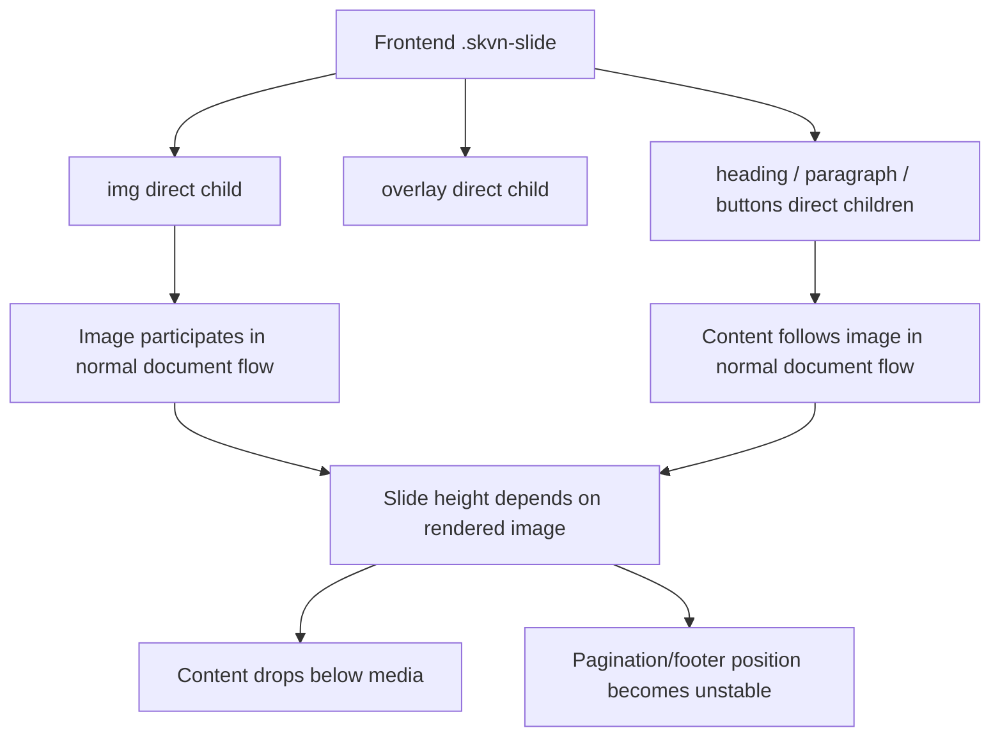
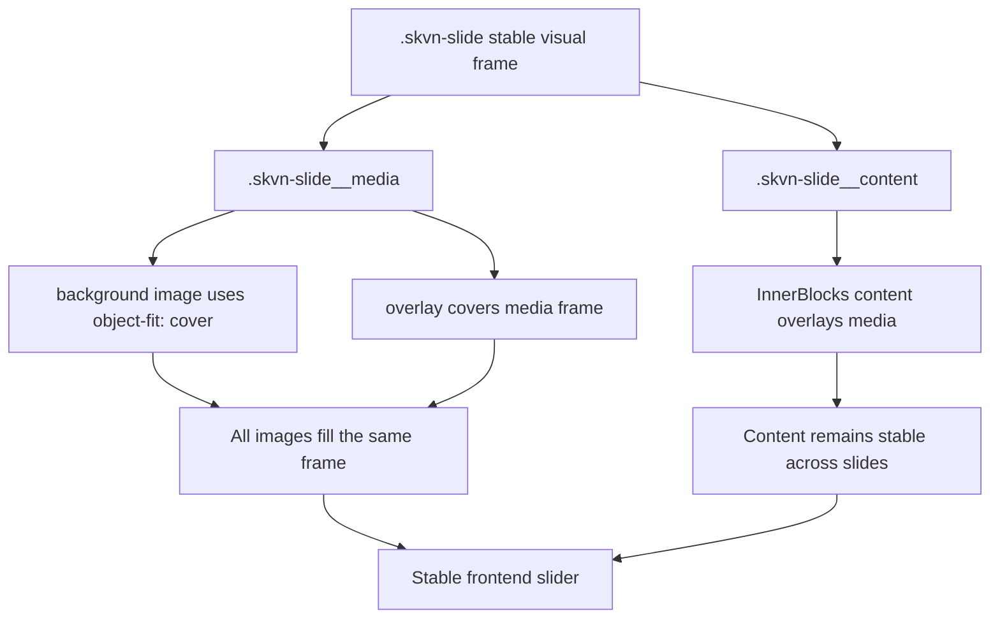

# Slider Frontend Media/Content Layer Bug — 1.2.1

Date: 2026-06-08
Status: documented; target fix moved to V1 / 1.3.0 dynamic rendering architecture
Milestone: V1 / 1.2.1 — SKVN Slider Presets & Inserter
Target QA milestone: V1 / 1.2.9 — Slider & Motion Onsite QA

## Summary

The Slider looks acceptable in the Gutenberg editor stacked preview, but the
frontend render breaks the intended hero composition. The background image is
rendered as a normal image in document flow and the slide text/buttons follow it
instead of overlaying the image.

This is not an image-resolution problem. Testing with a higher-resolution image
made the issue more visible: different slides produced different visual heights,
thin image strips, large empty white space, and pagination pushed toward the
footer.

## State Delta

```text
State A (correct): Gutenberg editor stacked preview.
State B (broken): Frontend/site render with Swiper initialized.
Delta: Frontend slide markup does not lock media, overlay, and content into
       separate layout layers.
```

Observed frontend HTML:

```html
<div class="wp-block-skvn-marine-slide skvn-slide swiper-slide skvn-slide--has-background">
  
  <span class="skvn-slide__overlay" aria-hidden="true"></span>
  <h2 class="wp-block-heading">Built for demanding marine operations</h2>
  <p>Present a clear campaign message...</p>
  <div class="wp-block-buttons">...</div>
</div>
```

The image, overlay, heading, paragraph, and buttons are siblings. Without a
stable frame and content wrapper, the browser lays them out in normal flow.

## Symptoms

- Slide background appears above the content instead of behind it.
- Heading, paragraph, and CTA appear below the image.
- Slide heights vary between images.
- A high-resolution image can produce an oversized image area on one slide and a
  thin image strip on another.
- Pagination and footer positioning become visually unreliable because the
  Slider height is not governed by a fixed slide frame.

## Root Cause

The frontend slide output lacks two required layers:

- `skvn-slide__media`: fixed/absolute media frame that owns image and overlay.
- `skvn-slide__content`: foreground content frame that owns InnerBlocks content.

The editor preview can still look correct because `edit.tsx` may build an
editor-only composition. The frontend dynamic render path must produce the same
layer contract.

## Required Frontend Markup

```html
<div class="wp-block-skvn-marine-slide skvn-slide swiper-slide skvn-slide--has-background">
  <div class="skvn-slide__media">
    
    <span class="skvn-slide__overlay" aria-hidden="true"></span>
  </div>

  <div class="skvn-slide__content">
    <h2 class="wp-block-heading">Built for demanding marine operations</h2>
    <p>Present a clear campaign message...</p>
    <div class="wp-block-buttons">...</div>
  </div>
</div>
```

## Required CSS Contract

```css
.skvn-slide {
  position: relative;
  min-height: clamp(520px, 72vh, 820px);
  overflow: hidden;
}

.skvn-slide__media {
  position: absolute;
  inset: 0;
  z-index: 0;
}

.skvn-slide__background-image {
  width: 100%;
  height: 100%;
  object-fit: cover;
}

.skvn-slide__overlay {
  position: absolute;
  inset: 0;
}

.skvn-slide__content {
  position: relative;
  z-index: 2;
}
```

Exact spacing, width, typography, and responsive values should follow existing
SKVN design tokens/classes. The important invariant is layer ownership, not the
literal values above.

## Bug Flow



## Correct Flow



## Fix Plan

The architecture audit confirmed that Slider/Slide currently uses static
Gutenberg saved markup, not a PHP `render_callback`. The initially proposed
static migration was superseded before implementation. The approved target is:

```text
V1 / 1.3.0 — Slider Dynamic Rendering Architecture
.context/planning/017_VERSION_1_3_0_SLIDER_DYNAMIC_RENDERING_ARCHITECTURE_PLANNING.md
```

1. Define PHP render callbacks for the Slider shell and Slide
   media/overlay/content layers.
2. Preserve current attributes, InnerBlocks content, namespaces, and editor
   behavior through an explicit compatibility path.
3. Keep `slide/edit.tsx` aligned with the same media/content layer model.
4. Update frontend CSS so image and overlay fill the media frame and content is
   positioned above it.
5. Keep Swiper responsible for slide movement, fade, loop, keyboard navigation,
   autoplay, arrows, and dots.
6. Do not introduce a custom slide manager, a second Slider runtime, or
   per-preset duplicated markup engines.

## Acceptance Checklist

- [ ] Editor stacked preview still displays every slide clearly.
- [ ] Frontend hero slide text overlays the image.
- [ ] Frontend image covers the same slide frame on every slide.
- [ ] Fade transition does not expose white gaps between slides.
- [ ] Dots/arrows remain positioned relative to the Slider, not the page footer.
- [ ] High-resolution and lower-resolution images behave consistently.
- [ ] `prefers-reduced-motion` behavior remains unchanged.
- [ ] Swiper keyboard navigation still works.

## Onsite Test Handoff

Target URL/page:

```text
https://minhhaifishery.com/slider-test/
```

Setup/preconditions:

- Use a page containing the SKVN Hero Slider preset.
- Include at least two slides.
- Use two images with noticeably different dimensions/aspect ratios.
- Test while logged in and, if possible, in an incognito/logged-out session.

Exact test steps:

1. Open the target page.
2. Hard refresh the page.
3. Confirm the first slide image fills one stable hero frame.
4. Confirm heading, paragraph, and CTA appear over the image.
5. Navigate to the next slide using arrow, dot, and keyboard.
6. Wait for autoplay to advance.
7. Resize to mobile width and repeat visual checks.

Expected UX/visual behavior:

- Each slide uses the same visual frame.
- Image fills the frame with `object-fit: cover`.
- Overlay covers the image.
- Content remains on top of the image.
- No large white gap appears between Slider and footer.

Pass/fail criteria:

- PASS when all slides keep media and content locked into the same visual frame.
- FAIL if any slide image becomes a normal flow image, content drops below it,
  or pagination/footer position changes due to slide height collapse.

Evidence human should report back:

- Screenshot of the first slide.
- Screenshot after navigating to the second slide.
- Browser/viewport.
- Console errors or warnings, if any.
- Whether the result differs when logged out/incognito.
