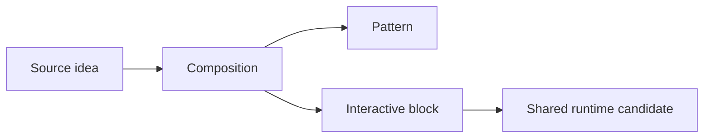

# Chôm RevSlider và Theme trả phí to Gutenberg

Status: active idea-intake and architecture review workflow

## Mục đích

Đây là nơi tập hợp các layout, slider, tab, accordion, animation, pattern và UX
đáng học từ RevSlider, theme trả phí, website tham khảo, HTML artifact hoặc ảnh
chụp màn hình.

Nguyên tắc:

```text
Học ý tưởng và interaction contract.
Không sao chép code, asset, font hoặc nội dung không có quyền sử dụng.
```

Mỗi ý tưởng phải được phân tích trước khi đưa vào SKVN Marine. Không biến một
ảnh đẹp thành custom block chỉ vì nó trông phức tạp.

---

## 1. Idea Inbox

Mỗi ý tưởng mới thêm một mục theo mẫu:

```markdown
## [Tên ý tưởng]

Status: inbox | analyzing | approved | parked | rejected | implemented
Date:
Source URL:
Source product/theme:
Local files:
Target page/use case:
Urgency:

### Điều đáng học

- 

### Không nên sao chép

- Code:
- Asset:
- Branding/content:
```

Có thể đính kèm:

- URL.
- Screenshot desktop/mobile.
- HTML đã render.
- Gutenberg markup hiện tại.
- Video interaction ngắn.
- Tên theme/plugin/preset nguồn.

---

## 2. Phân rã thiết kế

### Composition

Vẽ cấu trúc trước:

```text
Page section
├── Editorial content
├── Interactive component
└── Supporting proof / CTA
```

Xác định rõ:

- Phần nào chỉ là pattern/composition?
- Phần nào cần custom block?
- Phần nào dùng core Group, Columns, Heading, Image hoặc Buttons?
- Text bên ngoài có thực sự thuộc schema của component không?

### Interaction

Ghi state machine:

```text
Initial state
Hover state
Focus state
Active state
Transition state
Mobile tap state
Reduced-motion state
No-JavaScript state
```

Với tab/accordion/slider cần trả lời:

- Một hay nhiều item được mở?
- Desktop dùng hover, click hay cả keyboard focus?
- Mobile dùng tap, slider hay ẩn?
- Khi chuyển item, media và content thay đổi lúc nào?
- Có trạng thái rỗng hoặc nhấp nháy không?

### Motion

Phân loại motion:

- Layout expansion.
- Opacity/reveal.
- Transform.
- Parallax.
- Image crop/zoom.
- Progress/autoplay.

Kiểm tra:

- Motion có truyền đạt trạng thái hay chỉ trang trí?
- Có đang animate thuộc tính layout nặng như `width`, `height`, `flex` hoặc
  `auto` không?
- Có thể dùng `transform` hoặc `opacity` không?
- Có cần shared animation runtime không?
- `prefers-reduced-motion` xử lý thế nào?
- Có nên tắt parallax trên coarse pointer/mobile không?

---

## 3. State Delta Debug

Khi editor đúng nhưng frontend sai, hoặc trạng thái đầu đúng nhưng tương tác sai:

1. Ghi trạng thái đúng.
2. Ghi trạng thái sai.
3. So sánh markup, class, attribute và computed style.
4. Tìm thời điểm hoặc ancestor đầu tiên làm behavior thay đổi.
5. Sửa layer sở hữu lỗi, không vá component con.

Luôn kiểm tra:

```text
Saved Gutenberg markup
Rendered frontend HTML
body classes
.site
.site-content
.content-area
.inside-article
.entry-content
direct block wrapper
```

Đo:

- `display`
- `width`
- `max-width`
- margin
- padding
- flex/grid tracks
- overflow
- transition property/duration/delay
- image loading/decoding

---

## 4. Gutenberg Layout Contract

Mặc định phải giữ:

```text
Normal block -> contentSize
alignwide    -> wideSize
alignfull    -> full canvas
```

Pattern marketing full-width nên dùng:

```text
Outer alignfull surface with layout: default
└── Named inner container with wide max-width and auto margins
```

Không:

- Ép mọi `.entry-content > *` thành full-width.
- Tăng global `contentSize` để sửa một pattern.
- Dựa vào class sinh động `wp-container-*`.
- Dùng `!important` để chống Gutenberg layout engine.
- Đặt `layout: constrained` ở outer surface nếu direct child cần wide layout.

---

## 5. Quyết định Pattern Hay Block

### Dùng pattern khi

- Chỉ phối hợp core blocks và block đã có.
- Nội dung cần được xóa, di chuyển hoặc thay thế tự do.
- Không cần runtime/state riêng.
- Thiết kế là một composition, không phải component logic.

### Dùng custom block khi

- Có schema dữ liệu ổn định.
- Có interaction/runtime riêng.
- Cần editor controls được quản trị.
- Core blocks không thể lưu contract an toàn.

### Dùng variation/preset khi

- Cùng block, cùng runtime và cùng schema.
- Chỉ khác nội dung mẫu hoặc governed style/layout preset.

### Tạo block riêng khi

- Interaction contract khác bản chất.
- Lifecycle, navigation hoặc rendering khác.
- Nhét thêm variation sẽ làm block hiện tại thành nhiều sản phẩm ghép lại.

---

## 6. Reuse Review

Đánh dấu phần có thể tái sử dụng:

```markdown
### Shared candidates

- Disclosure/tab controller:
- Media layer:
- Overlay/contrast presets:
- Motion helper:
- Keyboard behavior:
- Mobile behavior:
- Full-width section shell:

### Must remain component-owned

- Saved markup:
- Attributes:
- Visual layout:
- Domain content:
```

Không tách shared abstraction chỉ vì hai file trông giống nhau. Chỉ tách khi có
ít nhất hai consumer thật và contract chung đã rõ.

---

## 7. Architecture Mapping

| Concern | Owner |
|---|---|
| Visual tokens, pattern, section shell | `skvn-marine` theme |
| Interactive Gutenberg block | `skvn-marine-blocks` plugin |
| Shared generic animation | Theme shared animation runtime |
| Slider navigation/core | Swiper in plugin Slider family |
| Editorial copy composition | Gutenberg pattern |
| External plugin functionality | External plugin, không copy vào repo |

Kiểm tra thêm:

- Thay theme thì feature có được phép mất không?
- Có đang tạo Slider engine thứ hai không?
- Có làm Accordion hiện tại gánh thêm contract không liên quan không?
- Có tạo static markup debt cần `deprecated[]` liên tục không?
- Có phụ thuộc GeneratePress internals không?

---

## 8. Responsive Và Accessibility

Phải mô tả riêng:

- Desktop wide.
- Desktop hẹp.
- Tablet.
- Mobile portrait.
- Mobile landscape.
- Touch laptop/coarse pointer.
- Keyboard only.
- Reduced motion.
- JavaScript disabled.

Checklist:

- Focus visible.
- Tab order hợp lý.
- Enter/Space hoạt động.
- Không phụ thuộc hover.
- Nội dung vẫn đọc được khi JS lỗi.
- Text không vỡ từng chữ.
- Không có horizontal overflow ngoài chủ ý.
- Media có ALT đúng.

---

## 9. Performance Và Licensing

### Performance

- Số lượng ảnh và kích thước.
- Lazy loading có làm ảnh xuất hiện trễ khi mở tab không?
- Image decode có gây flash không?
- Runtime có listener theo từng item không?
- Parallax có chạy trên mobile không?
- Có animate layout/reflow liên tục không?
- Dependency mới có thực sự cần thiết không?

### Licensing

- Không copy JavaScript/CSS từ sản phẩm trả phí.
- Không đóng gói lại ảnh demo, icon, font hoặc video nguồn.
- Không sao chép branding và nội dung nhận diện.
- Có thể học bố cục, interaction pattern và nguyên tắc motion rồi tự implement.
- Ghi nguồn tham khảo để audit, không tuyên bố thiết kế nguồn là của SKVN.

---

## 10. Milestone Routing

Sau phân tích, chọn một:

```text
Current milestone fix
Current milestone enhancement
Future Candidate
Named future milestone
Rejected
```

Không đưa feature mới vào milestone QA/hardening nếu nó làm thay đổi scope.

Nếu có conflict với context hiện tại:

- LOW: ghi tension, tiếp tục conservative.
- HIGH: ghi tension và dừng chờ human quyết định.

---

## 11. Kết luận Mỗi Ý Tưởng

```markdown
### Decision

Verdict: pattern | variation | extend block | new block | shared runtime | reject
Reason:
Theme files:
Plugin files:
Docs/context files:
Dependencies:
Migration risk:
Technical debt risk:
Target milestone:

### Mermaid



### Acceptance

- [ ] Editor/frontend parity
- [ ] Desktop/mobile behavior
- [ ] Keyboard and reduced motion
- [ ] No invalid block
- [ ] No licensed source copied
- [ ] Build/lint passes
- [ ] Onsite test documented
```

---

## 12. Quick Prompt Cho Chat Mới

```text
Hãy dùng tài liệu
docs/workflows/ideation-chom-revslider-theme-tra-phi-to-gutenberg.md
để phân tích ý tưởng đính kèm.

Trước khi đề xuất code:
1. Phân rã composition và interaction state.
2. So sánh pattern, variation, extend block và new block.
3. Xác định theme/plugin/shared runtime ownership.
4. Phân tích responsive, accessibility, performance và licensing.
5. Chỉ ra technical debt và compound debt.
6. Đề xuất milestone.
7. Vẽ Mermaid kiến trúc.

Không sửa source cho đến khi tôi duyệt hướng.
```
